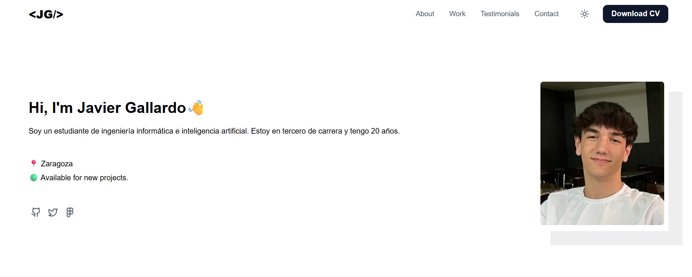
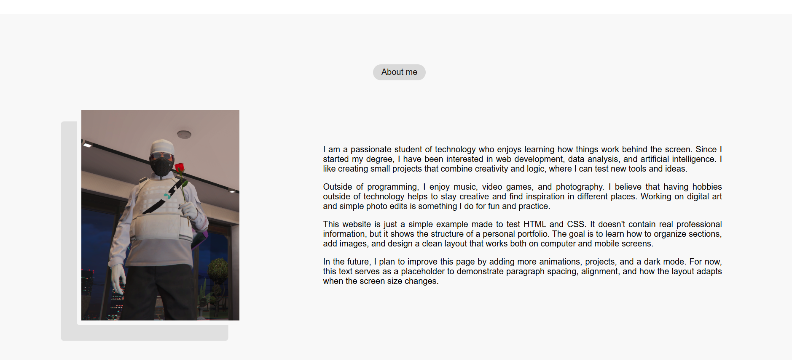
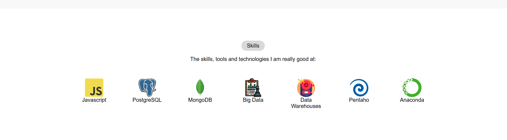
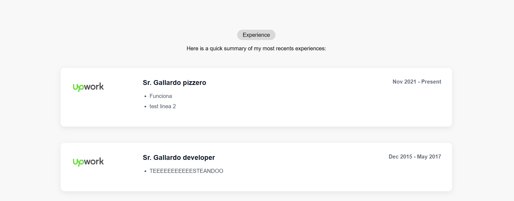
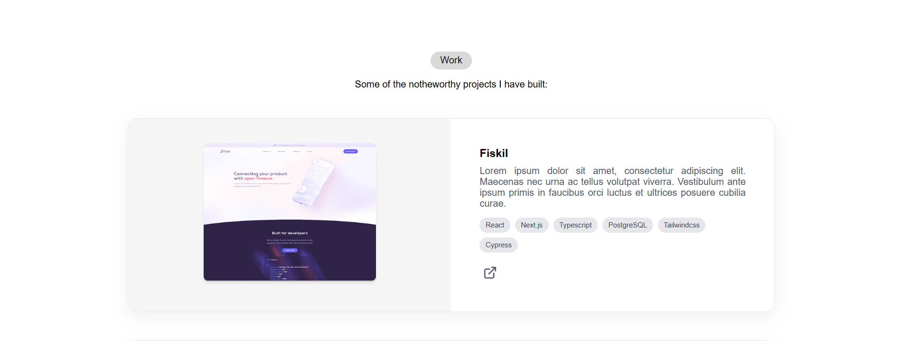
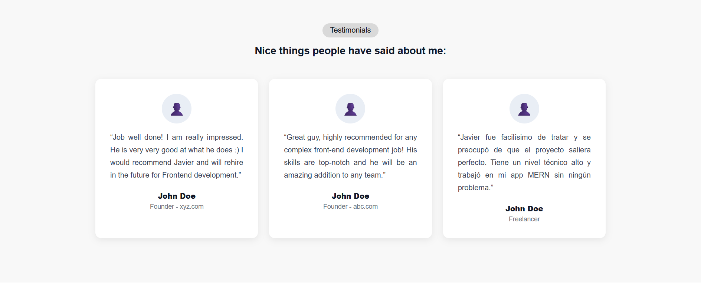
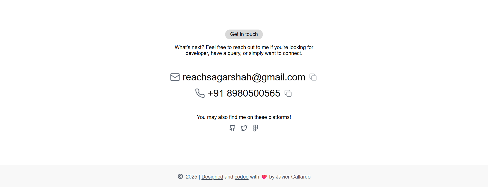
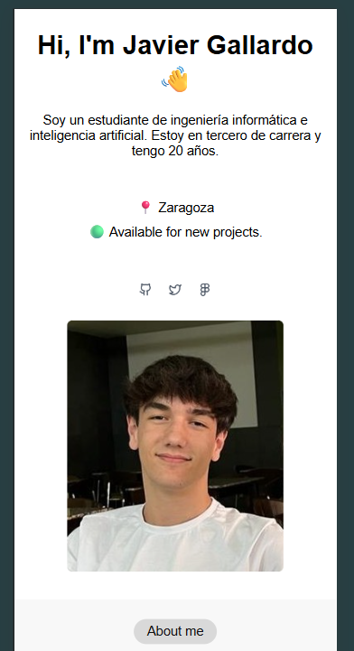

This project was created for the Web System subject. The main goal was to build a personal portfolio website using HTML and CSS. I started from a base template given by the teacher and then customized it with my own information, photos, and design.

The website includes several sections. The header has my logo <JG/> and the navigation menu. The hero section introduces me with my name, a short description, my city, and social media links. In the about section I added a small paragraph about myself and one image.

The skills section shows icons of the tools and technologies I know, like JavaScript, PostgreSQL, and MongoDB. In experience, I listed some example jobs to practice structure with divs and flexbox. The work section presents some sample projects with images and descriptions.

Then, the testimonials part includes example comments from people, and the contact section has my email, phone number, and social links. Finally, the footer includes a small message with my name.

The style is simple and modern, using flexbox, grid, margins, and responsive design. The website is online at https://j4vitxu.web.app
. With this project I learned how to organize HTML, apply CSS styles, and publish a website online using Firebase Hosting.

https://www.figma.com/design/KIXp840Ic0HLELpMQFGPc1/Personal-Portfolio-Website-Template-%7C-Mobile---Desktop--Community-?node-id=327-868&p=f&t=snXbrHiBJgG5DDIH-0

GitHub: https://github.com/J4VITXU/Sistemas-Web
