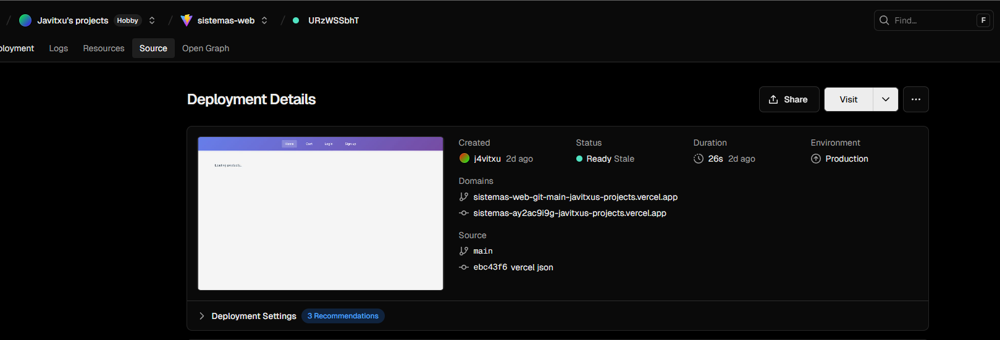
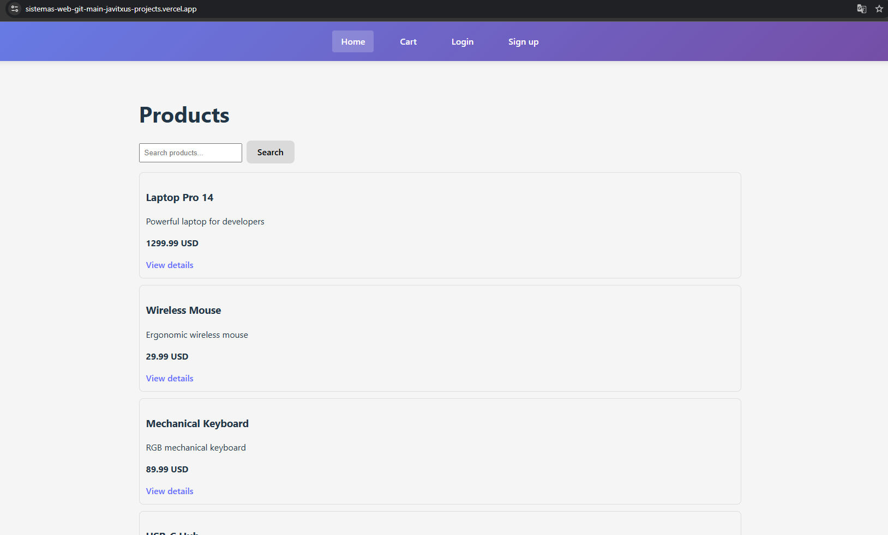
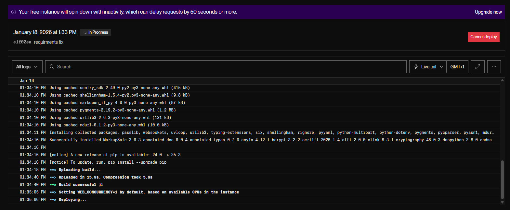

# E-commerce SPA – React + FastAPI

🔗 **Live demo:** https://sistemas-web-git-main-javitxus-projects.vercel.app/

Full-stack e-commerce application built as a **Single Page Application (SPA)** with a **React + TypeScript + Vite** frontend and a **FastAPI + SQLModel + SQLite** backend.

The project includes product browsing, search, cart management, checkout with server-side validation, user authentication, and order history.

---

## Tech Stack

### Frontend
- React
- TypeScript
- Vite
- React Router
- Fetch API
- JWT-based authentication

### Backend
- Python
- FastAPI
- SQLModel
- SQLite
- JWT (Bearer Token)
- OAuth2 Password Flow

---

## Project structure

- `frontend/react-router/` – React SPA
- `backend/` – FastAPI REST API

---

## Development setup

### Backend

From the `backend` directory:

```bash
fastapi dev app/main.py
```

### Optional: seed initial products
python seed_products.py

### Frontend
From the frontend/react-router directory:
  yarn dev

### Backend API configuration (frontend)

By default, the frontend communicates with the backend at:
  http://localhost:8000

The API base URL can be configured using the environment variable:
  VITE_API_BASE_URL=http://localhost:8000 yarn dev

Application features

- Product catalog
- Product search by text
- Product detail view with quantity selection
- Shopping cart with totals
- Checkout with server-side validation
- User registration and login
- JWT token handling
- Authenticated order history
- Client-side routing with React Router

### Routing (SPA)

The application uses React Router for client-side navigation.

Main routes include:
- Home (product listing)
- Product detail
- Cart
- Checkout
- Login
- Register
- Orders (authenticated users only)

### Authentication

Authentication is handled using JWT tokens.
- Tokens are stored in the browser
- Authenticated requests include the header:
  Authorization: Bearer <token>
- Protected routes require the user to be logged in

### Notes

The project is intended for local development and educational purposes.
The backend uses SQLite for simplicity.
Business logic and validation are handled server-side.
Frontend and backend are developed as independent applications.

## Demo user credentials

For testing and demonstration purposes, a user account is already created:

- **Email:** pepe@gmail.com  
- **Password:** 1234

These credentials can be used to log in and test authenticated features such as checkout and order history.


## Backend deployment (Render)

The backend API is deployed on Render as a web service.

Render automatically assigns the port used by the application.
For this reason, the backend is started using the environment
variable provided by the platform:

uvicorn app.main:app --host 0.0.0.0 --port $PORT

This allows the FastAPI application to run correctly both in
local development and in the production environment on Render.


### Routing in production (Vercel)

The frontend is deployed as a Single Page Application (SPA) using
React Router with `BrowserRouter`.

In production, direct access or page reloads on routes such as
`/cart`, `/orders`, or `/checkout` require special server configuration.

Since these routes are handled client-side by React Router and do not
exist as real files on the server, the hosting platform must redirect
all incoming requests to the main entry point of the application.

For this reason, the project includes a `vercel.json` file that rewrites
all routes to `/`, allowing React Router to correctly resolve the view
on page reloads.



